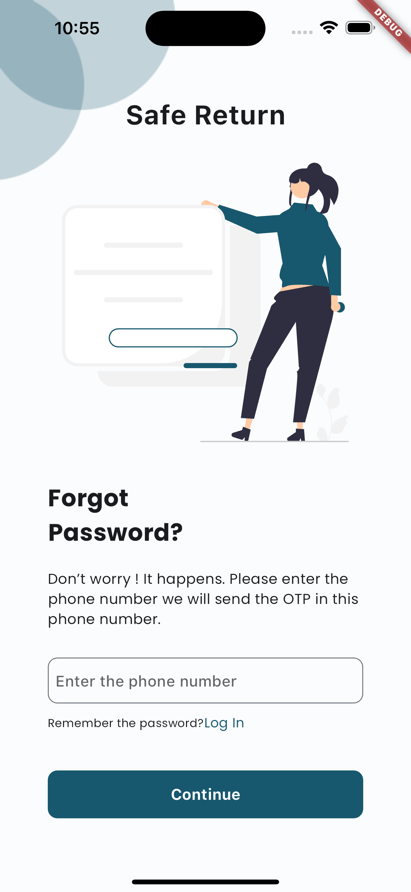
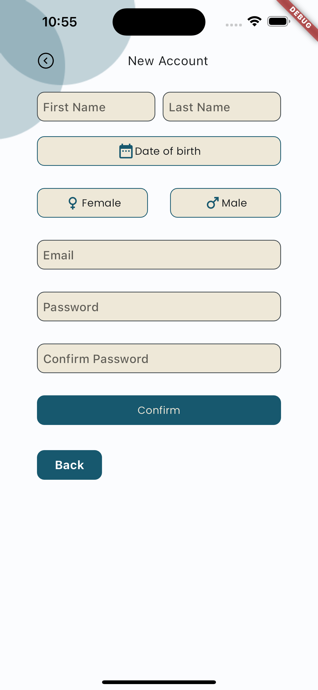
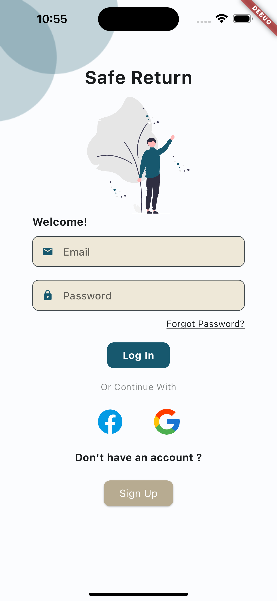

# Project Safe Return

## Overview
**Project Safe Return** is an application designed to assist parents in locating their children and ensuring their protection and safe return. The main goal of this application is to provide peace of mind to parents by utilizing technology to enhance child safety and provide immediate assistance when needed. 

I hope you like it.

## Technologies Used
- **Flutter**: For building the cross-platform mobile application.
- **Firebase**: For real-time database and backend services.
- **Java Spring Boot**: For building the server-side application.
- **MVVM (Model-View-ViewModel)**: For structured and maintainable code architecture.
- **Provider**: For state management in Flutter.
- **Mockito**: For unit testing and mocking in the application.

## Design and Media
- [Figma Design Link](https://www.figma.com/community/file/1347293828810010889/safe-return)

|            |  |

|            |  |


## Features
- Real-time location tracking of children.
- Emergency alerts and notifications to parents.
- Secure data storage and retrieval.
- User-friendly interface for ease of use.
- Integration with emergency services for immediate assistance.

## Setup Instructions
1. **Clone the Repository**:
   ```sh
   git clone https://github.com/TimileyinBakare/Safe-Return.git
   cd safe-return

## Install Flutter Dependencies:
  flutter pub get
  Flutter run

## Testing
Unit tests are written using Mockito. To run the tests, use:
flutter test

## License

This project is licensed under the MIT License - see the LICENSE file for details.

## Contact
   For any inquiries or support, please contact:
   Email: bakaretim18@gmail.com
   LinkedIn: https://linkedin.com/blackwadud
